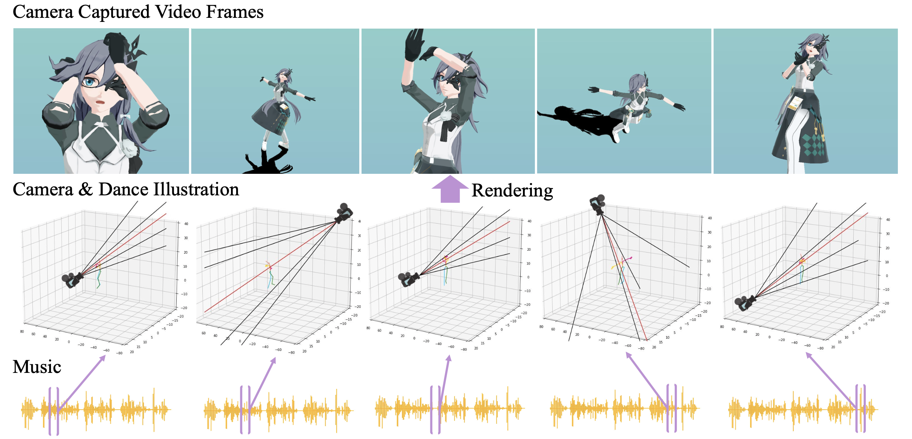

## DanceCamera3D &mdash; Official PyTorch implementation

Code for CVPR 2024 paper "DanceCamera3D: 3D Camera Movement Synthesis with Music and Dance"

✨ Do not hesitate to give a star! ✨



> Choreographers determine what the dances look like, while cameramen determine the final presentation of dances. Recently, various methods and datasets have showcased the feasibility of dance synthesis. However, camera movement synthesis with music and dance remains an unsolved challenging problem due to the scarcity of paired data. Thus, we present \textbf{DCM}, a new multi-modal 3D dataset, which for the first time combines camera movement with dance motion and music audio. This dataset encompasses 108 dance sequences (3.2 hours) of paired dance-camera-music data from the anime community, covering 4 music genres. With this dataset, we uncover that dance camera movement is multifaceted and human-centric, and possesses multiple influencing factors, making dance camera synthesis a more challenging task compared to camera or dance synthesis alone. To overcome these difficulties, we propose \textbf{DanceCamera3D}, a transformer-based diffusion model that incorporates a novel body attention loss and a condition separation strategy. For evaluation, we devise new metrics measuring camera movement quality, diversity, and dancer fidelity. Utilizing these metrics, we conduct extensive experiments on our DCM dataset, providing both quantitative and qualitative evidence showcasing the effectiveness of our DanceCamera3D model.

## Requirements

* 64-bit Python 3.7+
* PyTorch 1.12.1
* At least 18 GB RAM per GPU
* 1&ndash;6 high-end NVIDIA GPUs with at least 18 GB of GPU memory, NVIDIA drivers, CUDA 11.6 toolkit.

The example build this repo was validated on:

* Linux ubuntu 4.15.0-213-generic
* 64-bit Python 3.7.12
* PyTorch 1.13.1
* 18 GB RAM
* 6 x NVIDIA RTX 3090, CUDA 11.6 toolkit

This repository additionally depends on the following libraries, which may require special installation procedures:

* [jukemirlib](https://github.com/rodrigo-castellon/jukemirlib)
* [accelerate](https://huggingface.co/docs/accelerate/v0.16.0/en/index)
  * Note: after installation, don't forget to run `accelerate config` . We use fp16 following [EDGE](https://github.com/Stanford-TML/EDGE/blob/main/README.md).

## Getting started

### Download DCM Dataset

**This dataset is available only for the academic use.** Out of respect and protection for the original data providers, we have collected all the links to the raw data for users to download from the original data creators. Please show your appreciation and support for the work of the original data creators by liking and bookmarking their content if you use this data. Please adhere to the usage rules corresponding to this original data; any ethical or legal violations will be the responsibility of the user. The users must sign the eula form at `media/DCM-EULA-20240318.pdf` and send the scanned form to [wangzixu21@mails.tsinghua.edu.cn](wangzixu21@mails.tsinghua.edu.cn). Once approved, you will be supplied with a download link.

* Download the DCM dataset and put it under the `DCM_data/` folder.
* (Optional) Download raw data following `DCM_data/LinkOfRawData.xlsx`. Rename and move camera and motion data as `DCM_data/amc_raw_data/amc*/c*.vmd` and `DCM_data/amc_raw_data/amc*/m*.vmd`, in which `*` means the data index.
* (Optional) Check the downloaded raw data by running

```.python
python3 check_raw_data.py --dcm_raw_dir DIR_OF_RAW_DATA --file_size_json DCM_data/split/file_size.json
```

* Preprocess the data by running

```.bash
bash sh/data_preprocess.sh
```

* Create the dataset by running

```.bash
bash sh/create_dataset.sh
```

### Quickstart

* Download the saved model checkpoint from [Google Drive](https://drive.google.com/file/d/1SEBYHD7FqVM5J0w79Ra3nYZAMerj_q_L/view?usp=sharing) .
* Generate results with the downloaded checkpoint by running

```.python
python3 scripts/test.py --test_mode long \
--gw1 1.75 --gw2 1 \
--camera_format polar \
--label exp-gw-1.75-1 \
--checkpoint train-3000.pt \
--condition_separation_CFG True \
--render_dir renders/DanceCamera3D_SepCFG_PolarCam/test_demo/ \
--music_dir DCM_data/amc_data_split_by_categories/Test/Audio \
--motionGT_dir DCM_data/amc_data_split_by_categories/Test/Simplified_MotionGlobalTransform 
```

* Evaluate results by running

```.python
python3 scripts/evaluate.py --result_dir renders/DanceCamera3D_SepCFG_PolarCam/test_demo/long-exp-gw-1.75-1
```

* (Optional) Smooth the camera movement using filters by running
```.bash
python3 scripts/camera_filter_multicut.py \
--input_dir renders/DanceCamera3D_SepCFG_PolarCam/test_demo/long-exp-gw-1.75-1/CameraCentric \
--output_dir renders/DanceCamera3D_SepCFG_PolarCam/test_demo/long-exp-gw-1.75-1/CameraFiltered \
```

* Convert the results to `.vmd` format that can be viewed in [Saba_Viewer](https://github.com/benikabocha/saba) by running

```.bash
python3 scripts/extend_camera_results.py --split_json DCM_data/split/long2short.json \
--source_camera_dir renders/DanceCamera3D_SepCFG_PolarCam/test_demo/long-exp-gw-1.75-1/CameraFiltered \
--target_camera_extend_dir renders/DanceCamera3D_SepCFG_PolarCam/test_demo/long-exp-gw-1.75-1/extend_json \
--target_camera_vmdjson_dir renders/DanceCamera3D_SepCFG_PolarCam/test_demo/long-exp-gw-1.75-1/extend_vmdjson

python3 scripts/json2vmd.py \
--json_dir renders/DanceCamera3D_SepCFG_PolarCam/test_demo/long-exp-long-gw-1.75-1/extend_vmdjson/ \
--vmd_dir renders/DanceCamera3D_SepCFG_PolarCam/test_demo/long-exp-long-gw-1.75-1/extend_vmd/ \
--data_type camera
```
### Visualization
For visualization in [Saba_Viewer](https://github.com/benikabocha/saba), we recommand human models similar to [符华 from 神帝宇](https://www.aplaybox.com/u/359396473?searchKeyword=符华). The charactor model we used for demo is modified by [凛逸](https://space.bilibili.com/1561923759) and [神帝宇](https://www.aplaybox.com/u/359396473), copyrights to [miHoYo](https://www.mihoyo.com.).

By the way, there are two changes to the source code of [Saba_Viewer](https://github.com/benikabocha/saba):

(1) For the reason that the camera FOV data is saved as `int` in the original `.vmd` files but `float` in our exported `.vmd` files, you need to modify the following codes to visualize the synthesized camera file:

```.c
////saba-master/src/Saba/Model/MMD/VMDFile.h
//uint32_t		m_viewAngle;//for original camera .vmd file
float		m_viewAngle;//for synthesized camera .vmd file
```

(2) Do simple interpolation to the animation to produce more stable results:

```.c
////saba-master/src/Saba/Model/MMD/VMDCameraAnimation.cpp
//Comment out the following code from line 56~89
// if ((key1.m_time - key0.m_time) > 1)
// {
// 	float timeRange = float(key1.m_time - key0.m_time);
// ...
// 	m_camera.m_distance = key0.m_distance;
// 	m_camera.m_fov = key0.m_fov;
// }

//Add the following code
float timeRange = float(key1.m_time - key0.m_time);
float time = (t - float(key0.m_time)) / timeRange;
float ix_x = key0.m_ixBezier.FindBezierX(time);
float iy_x = key0.m_iyBezier.FindBezierX(time);
float iz_x = key0.m_izBezier.FindBezierX(time);
float rotate_x = key0.m_rotateBezier.FindBezierX(time);
float distance_x = key0.m_distanceBezier.FindBezierX(time);
float fov_x = key0.m_fovBezier.FindBezierX(time);

float ix_y = key0.m_ixBezier.EvalY(ix_x);
float iy_y = key0.m_iyBezier.EvalY(iy_x);
float iz_y = key0.m_izBezier.EvalY(iz_x);
float rotate_y = key0.m_rotateBezier.EvalY(rotate_x);
float distance_y = key0.m_distanceBezier.EvalY(distance_x);
float fov_y = key0.m_fovBezier.EvalY(fov_x);

m_camera.m_interest = glm::mix(key0.m_interest, key1.m_interest, glm::vec3(ix_y, iy_y, iz_y));
m_camera.m_rotate = glm::mix(key0.m_rotate, key1.m_rotate, rotate_y);
m_camera.m_distance = glm::mix(key0.m_distance, key1.m_distance, distance_y);
m_camera.m_fov = glm::mix(key0.m_fov, key1.m_fov, fov_y);
```

### Train your own model

Run the training script, e.g.

```.bash
bash sh/train.sh
```

to train the model with the settings from the paper. The training will log progress to `wandb` and intermittently produce sample outputs to visualize learning. It takes ~15 hours with our setting of 6 x NVIDIA RTX 3090.

## Todo

* scripts for automatically exporting the motion data from `.vmd` files.
* video demo.

## Development

This is a research implementation and, in general, will not be regularly updated or maintained long after release.

## Citation
If you find this work useful for your research, please cite our paper:
```.bash
@article{Wang2024DanceCamera3D,
  title={DanceCamera3D: 3D Camera Movement Synthesis with Music and Dance},
  author={Wang, Zixuan and Jia, Jia and Sun, Shikun and Wu, Haozhe and Han, Rong and Li, Zhenyu and Tang, Di and Zhou, Jiaqing and Luo, Jiebo},
  booktitle={Proceedings of the IEEE/CVF conference on computer vision and pattern recognition},
  pages={},
  year={2024},
}
```
## Acknowledgements

We would like to thank [benikabocha](https://github.com/benikabocha) for the [Saba_Viewer](https://github.com/benikabocha/saba), [Stanford-TML](https://github.com/Stanford-TML) for the [EDGE](https://github.com/Stanford-TML/EDGE/blob/main/README.md), and [lucidrains](https://github.com/lucidrains) for the [Adan](https://github.com/lucidrains/Adan-pytorch) and [diffusion](https://github.com/lucidrains/denoising-diffusion-pytorch) repos. We would like to express our sincerest gratitude to all providers of publicly available data that we use.
